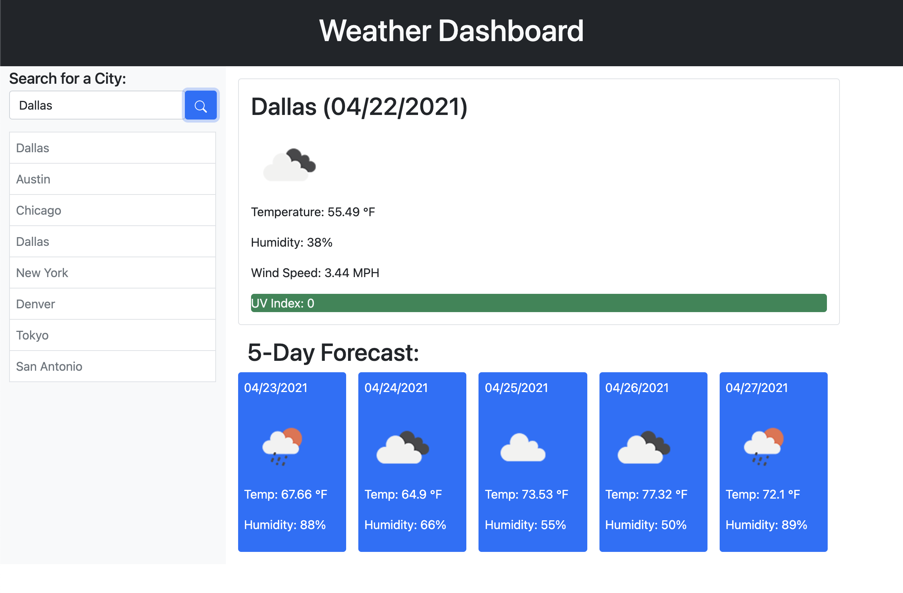
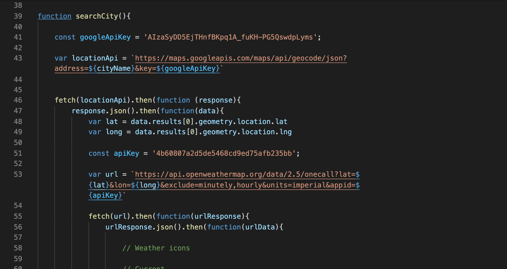

# Weather Dashboard

## Intro

Want to see what the weather looks like in a city before you travel there?

Here you go!

## Purpose

The purpose for this website is for you to search for a particular city and then be able to see the current weather. You will also be presented with a five day forecast for that city.

## Client Side

On the client side of this website, the user is presented with a user friendly experience. Once they type their desired city, they click the search button and the city is then populated with the current date. They will also be presented with the five day forecast for that same city at the bottom of the page.

## The Code Magic

There is alot going on back end of this app.

First off there are two different server APIs that turn the typed city into a lat and long destination. The coordinates are then passed to the second API that gets the weather conditions and forecast. Lastly, all of that collected data is printed to the page.

## Deployed Link

https://chancevaughn.github.io/Weather-Dashboard/

## Contributors

Chance V. Robinson

## License

N/A